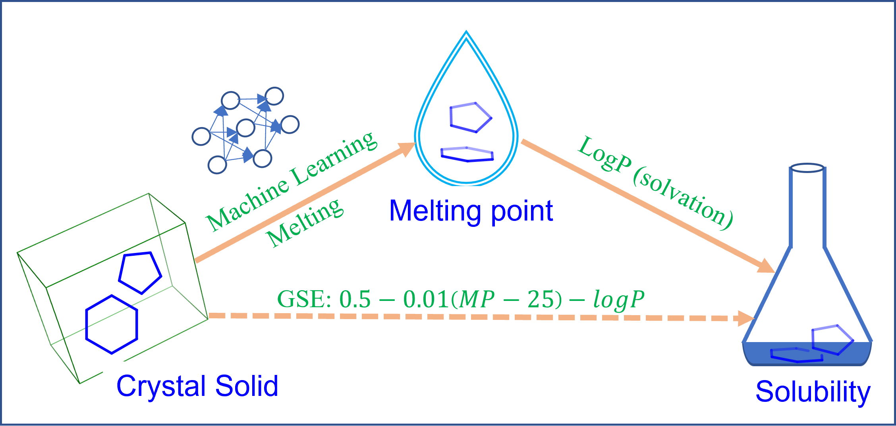

<p align="center">
  
 </p>


**OpenSOL**
==========
OpenSOL is a toolkit for Solubility prediction. The goal is to develop and implement machine learning  models by taking advantage of over 100K melting point data in the [Cambridge Structural Database (CSD)](https://www.ccdc.cam.ac.uk/) and compute solubility by the [General Solubility Equation (GSE)]((https://pubs.acs.org/doi/10.1021/ci000338c)). It can also be used to predict melting point.

Main features
=============
* Downloading and curating melting point data 
* Calculating RDKit 2D, 3D, and Morgan Fingerprint descriptors
* Building machine learning models (XGBoost, Random Forest, and Deep Neural Network) for melting point
* Predicting melting point and solubility by the GSE.
* Supporting solubility prediction by [ESOL](https://pubs.acs.org/doi/10.1021/ci034243x)

Installation
============
## Requirements
* Python 3.9 or newer (we recommend Anaconda distribution) 
* If you want to build DNN models
  * Modern NVIDIA GPU
  * CUDA 11 or newer
### General installation

* In Anaconda environment:
  ```
  git clone https://github.com/sutropub/OpenSOL.git
  cd OpenSOL
  conda create --name OpenSOL python=3.9
  conda activate OpenSOL
  conda install --yes --file requirements.txt
  pip install rdkit-pypi
  ```
* Pytorch is required to build DNN models.
  * Caveat: install pytorch that is compatibale with the CUDA driver on your computer
    ```
    conda install pytorch pytorch-cuda=11.7 -c pytorch -c nvidia
    ```

Running OpenSOL
===============
* `solubility_model.py` arguments:
  ```
  $ python solubility_model.py
  usage: solubility_model.py [-h] [--dirs DIRS] [--input INPUT] [--output OUTPUT] [--split SPLIT] [--dscr DSCR] [--gpu GPU] [--njobs NJOBS] [--clogP CLOGP] [--job JOB] [--model MODEL]

  Program for Solubility(logS) Prediction:

  optional arguments:
    -h, --help            show this help message and exit
    --dirs DIRS, -d DIRS  Directory
    --input INPUT, -i INPUT
                          input file
    --output OUTPUT, -o OUTPUT
                          output file
    --split SPLIT, -s SPLIT
                          split type: clustering or random
    --dscr DSCR, -dscr DSCR
                          descriptors: rdkit_2d, rdkit_3d, rdkit_2d_3d, or rdkit_fps
    --gpu GPU, -g GPU     the series number of GPU: 0 or 1
    --njobs NJOBS, -n NJOBS
                          the number of jobs running simultaneously
    --clogP CLOGP, -c CLOGP
                          clogP is available: True or False or a numeric value
    --job JOB, -j JOB     Job to do: dataPred, Modeling, Prediction, distCalc
    --model MODEL, -m MODEL
                          machine learning model: random_forest, xgboost, dnn
  ```

## Use examples
* A XGBoost model, which was the best one as shown in our [paper](https://pubs.acs.org/doi/abs/10.1021/acs.jcim.3c00308), is provided in `./Models/xgboost_rdkit_2d_clustering_model.json`. It can be used directly for prediction.
* A quick prediction on one molecule

  ```
  python solubility_model.py -j Prediction -m xgboost -dscr rdkit_2d -s clustering -i 'O=C(O)C=1C=CC=CC1OC(=O)C' -o aspirin.csv
  ```

* Predicting a list of molecules. The input file should has at least one SMILES column

  ```
  python solubility_model.py -j Prediction -m xgboost -dscr rdkit_2d -s clustering -i ./../Test/clean/SI_dataset_one.csv -o ./SI_dataset_one_sol.csv -c False
  ```

## Downloading melting point data
* If you have the CCDC software suite (**CSD Python API**) installed on your computers. To run the downloading script `CSD_mp_extract.py` from the command prompt, you will first need to activate your environment. The activation method will vary depending on the platform:
  * Activate CCDC environment in Windows command prompt

    ```
    "C:\Program Files\CCDC\Python_API_2022\miniconda\Scripts\activate"
    ```
  * MacOS/Linux: Open a terminal window and change directory to the CSD Python API bin folder:
    ```
    cd /Applications/CCDC/Python_API_2022/miniconda/bin
    ```
  * Then activate the environment with:
    ```
    source activate
    ```
  
* Above instructions work on 2022 CSD Release. If you have a different release, say 2023, just replace 2022 in above command lines with 2023. 
* Then run the following command lines to download CSD melting point data to this directory: `./Dataset`
  ```
  cd Scripts
  python CSD_mp_extract.py -o ./../Datasets/CSD_melting_point.csv
  ```
* If you want incorporate internal melting point data into the CSD dataset. Write your own scripts to retrieve data from a Database and append them to the CSD dataset. Below is one example and users need to complete the dummy SQL query in it:

  ```
  python Corporate_mp_extract.py -n hostname -d database_name -u user_name -p password -f ../Datasets/CSD_melting_point.csv
  ```

* The output CSD dataset or combined one have three fileds
  * refcode: compound ID
  * Melting point: data to be curated, default unit is Celsius (<sup>o</sup>C)
  * SMILES: smiles structure of molecules 

## Data curation
* Remove a few hundred of qualitative descriptions from which no specific melting point can be extracted. Some example are thermal decomposition, sublimes at 130deg.C, above 240deg.C(dec), Decomposes at 218 deg.C, less than 300deg.C, and >684 K
* Average measurements with melting range such as 521-6 K(dec.), 521-522K, 252-256deg.C, and 252-7deg.C;
* Convert those melting points in Celsius to Kelvin.
* Deduplicate molecules with the same SMILES string and the same melting point.
* Remove molecules with a melting point lower than room temperature (298K) or higher than 377 <sup>o</sup>C (650K) 
* Remove molecules with melting points ranges greater more than 10 degrees.
* Compute descriptors (RDKit 2D, 3D, and Morgan Fingerprint).
* Split the dataset into training/test sets based on random selection and a [Clustering based algorithm](https://pubs.acs.org/doi/pdf/10.1021/ci9803381).

  ```
  python solubility_model.py -j dataPrep -i ../Datasets/CSD_melting_point.csv
  ```

* Compute the Tanimoto similarity between the training and test sets with random and clustering (realistic) split.

```
python solubility_model.py -j distCalc
```
## Model development
* Here we show examples of developing machine learning melting point models using three methods (random_forest, xgboost, and dnn) based on diffrent descriptors (rdkit_2d, rdkit_3d, rdkit_2d_3d, and rdkit_fps) and different training/test split (random and clustering).

  ```
  python solubility_model.py -j Modeling -m xgboost -dscr rdkit_2d -s clustering -n 4

  python solubility_model.py -j Modeling -m random_forest -dscr rdkit_2d -s random -n 4

  nohup python solubility_model.py -j Modeling -m dnn -dscr rdkit_fps -s clustering -g 0  > dnn_rdkit_2d_clustering &
  ```

* If you don't have access to the CSD database. An alternative option is to download the **Sutro melting point training data** from the [Cambridge Crystallographic Data Centre (CCDC) website](https://www.ccdc.cam.ac.uk/support-and-resources/downloads/) under the **Validation Test Sets** section. You'll see two joblib files with an extention of **.job** as shown below after unziping the download.
  * melting_point_fps.job: a binary file of Rdkit radius 2, 1024 bits fingerprint
  * melting_point_rdkit_2d.job: a binary file of RDKit 2D descriptors
* Put those two joblib files directly under `./Datasets`. To view them, please refer to this notebook: `./Jupyter/data_overview.ipynb`.


## Solubility prediction
* Deploy a **Random Forest** model built with **RDKit 2D** descriptors using hyperparameters fine tuned based on a **clustering** split.
  ```
  python solubility_model.py -j Prediction -m random_forest -dscr rdkit_2d -s clustering -i ./../Test/clean/SI_dataset_one.csv -o ./../Test/prediction/SI_dataset_one_sol.csv -c False
  ```
* Predict solubility by ESOL

  ```
  python solubility_model.py -j Prediction -m esol -i ./../Test/clean/SI_dataset_one.csv -o ./../Test/prediction/SI_dataset_one_sol.csv
  ```

## External validation
* Six external validation sets in this directory: `./Test/clean`
* Six external validation sets with predictions by OpenSOL in this directory: `./Test/prediction`
* A Jupyter notebook for analysis of external validations in this directory: `./Jupyter/external_validation_analysis.ipynb`
* Statistical Tables generated by the notebook in this directory: `./Test/stat`
* Graphs generated by the notebook in this directory: `./Test/graph`

## Publication
* Zhu X, Polyakov VR, Bajjuri K, Hu H, Maderna A, Tovee CA, Ward SC. Building Machine Learning Small Molecule Melting Points and Solubility Models Using CCDC Melting Points Dataset. J Chem Inf Model [Internet]. 2023 May 1; Available from: https://doi.org/10.1021/acs.jcim.3c00308

## Acknowledgement
* We thank the **CCDC** for hosting the curated melting point datasets on their website and made them publicly available for all users.

## Contact Information
* Please submit a GitHub pull request for any issue or upgrade. For personal communication related to this package, please contact Xiangwei Zhu (xwzhunc at gmail.com) and Valery Polyakov (valery.polyakov at gmail.com).

